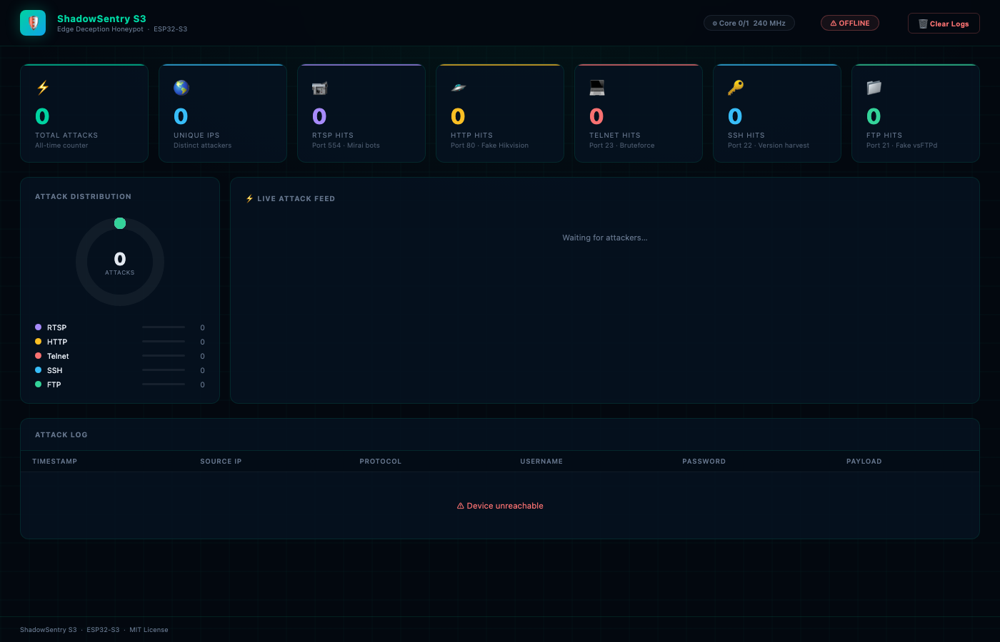

# ShadowSentry S3

> Zero-Configuration, Serverless Hardware Honeypot on a Single ESP32-S3



ShadowSentry S3 — автономний апаратний honeypot класу **Edge Deception**. Перетворює одну плату ESP32-S3 (~$5) на невидиму пастку для ботнетів, сканерів та малварі всередині локальної мережі. Не потребує Raspberry Pi, хмарних серверів чи зовнішніх баз даних — усі обчислення та логи зберігаються на одному чипі.

---

## Як це працює

Завдяки двоядерному процесору Xtensa LX7 проєкт розділено на два ізольованих світи:

| Ядро | Роль | Задачі |
|------|------|--------|
| **Core 0** — Hacker World | Приймає атаки | RTSP :554 · HTTP :80 · Telnet :23 · SSH :22 · FTP :21 |
| **Core 1** — Admin World  | Управління та сповіщення | Admin Panel :9999 · Telegram · SPIFFS |

```
Зловмисник / бот
     │
     ├─ Port 554  (RTSP)   → Fake Hikvision DS-2CD camera  ─┐
     ├─ Port  80  (HTTP)   → Fake Hikvision NVR login page  │
     ├─ Port  23  (Telnet) → Fake Ubuntu 20.04 server       ├──► log_store → SPIFFS
     ├─ Port  22  (SSH)    → Fake OpenSSH 8.9p1             │         │
     └─ Port  21  (FTP)    → Fake vsFTPd 3.0.5             ─┘         ▼
                                                                Telegram Alert
                                                                       │
                                                              Admin Panel :9999
                                                             (Dark-mode Dashboard)
```

### Що захоплюється

| Протокол | Перехоплюється | Приклад |
|----------|---------------|---------|
| RTSP | Username + Password | `admin:12345` з Basic Auth заголовку |
| HTTP | Username + Password | POST-форма логіну NVR |
| Telnet | Username + Password | Інтерактивний login prompt (до 5 спроб) |
| SSH | Client version string | `SSH-2.0-OpenSSH_7.4p1 Debian-10` |
| FTP | Username + Password | `USER admin` / `PASS password` (RFC 959) |

> SSH не захоплює credentials — після обміну банерами весь трафік шифрується. Натомість version string є корисним fingerprint атакуючого.

---

## Вимоги

### Апаратне забезпечення

- **ESP32-S3** DevKit (будь-яка плата з ≥ 4 MB Flash)
- USB-кабель для прошивки
- Wi-Fi мережа 2.4 GHz

### Програмне забезпечення

| Компонент | Версія |
|-----------|--------|
| [ESP-IDF](https://docs.espressif.com/projects/esp-idf/en/stable/esp32s3/) | **v5.2+** |
| Python | 3.8+ |
| CMake | 3.16+ |

---

## Встановлення ESP-IDF

### macOS / Linux

```bash
git clone --recursive https://github.com/espressif/esp-idf.git ~/esp/esp-idf
cd ~/esp/esp-idf
git checkout v5.2.1
./install.sh esp32s3
. ./export.sh
```

### Windows

Завантажити та запустити [ESP-IDF Windows Installer](https://dl.espressif.com/dl/esp-idf/).

> Після інсталяції відкривати **ESP-IDF Command Prompt** для всіх команд нижче.

---

## Налаштування

```bash
# Скопіювати шаблон конфігурації
cp main/config.h.example main/config.h

# Відредагувати під свої параметри
nano main/config.h
```

Усі параметри знаходяться в **одному файлі** — `main/config.h`:

```c
// Мережева ідентичність (що видно в списку пристроїв роутера)
#define DEVICE_HOSTNAME     "Hikvision-NVR"

// Wi-Fi
#define WIFI_SSID           "YourWiFiSSID"
#define WIFI_PASSWORD       "YourWiFiPassword"

// Telegram (отримати через @BotFather)
#define TELEGRAM_BOT_TOKEN  "YOUR_BOT_TOKEN"
#define TELEGRAM_CHAT_ID    "YOUR_CHAT_ID"

// Admin panel  →  http://<ip>:9999
#define ADMIN_PASSWORD      "changeme1"
#define ADMIN_PORT          9999

// Honeypot ports
#define RTSP_PORT           554
#define HTTP_PORT           80
#define TELNET_PORT         23
#define SSH_PORT            22
#define FTP_PORT            21
```

> `main/config.h` додано до `.gitignore` — реальні credentials ніколи не потраплять до репозиторію.

### Отримати Telegram Bot Token

1. Написати `/newbot` боту [@BotFather](https://t.me/BotFather)
2. Скопіювати отриманий token в `TELEGRAM_BOT_TOKEN`
3. Написати будь-що своєму боту, потім відкрити:
   `https://api.telegram.org/bot<TOKEN>/getUpdates`
4. Знайти `"chat":{"id":...}` — це твій `TELEGRAM_CHAT_ID`

---

## Збірка та прошивка

```bash
# 1. Клонувати репозиторій
git clone https://github.com/Rdx1S/ShadowSentryS3.git
cd ShadowSentryS3

# 2. Активувати ESP-IDF
. ~/esp/esp-idf/export.sh

# 3. Скопіювати та заповнити конфіг
cp main/config.h.example main/config.h
nano main/config.h

# 4. Зібрати і прошити (замінити /dev/ttyUSB0 на свій порт)
idf.py -p /dev/ttyUSB0 flash monitor
```

### Визначення порту

| OS | Команда |
|----|---------|
| Linux | `ls /dev/ttyUSB*` або `ls /dev/ttyACM*` |
| macOS | `ls /dev/cu.usb*` |
| Windows | Диспетчер пристроїв → Ports (COM & LPT) |

---

## Перший запуск

Після прошивки в моніторі з'явиться:

```
I (426) MAIN: ╔══════════════════════════════════════╗
I (428) MAIN: ║    ShadowSentry S3  v1.0             ║
I (434) MAIN: ║    Edge Deception HoneyPot           ║
I (439) MAIN: ║    ESP32-S3  |  ESP-IDF v5.x         ║
I (444) MAIN: ╚══════════════════════════════════════╝
I (1827) WIFI: IP acquired: 192.168.1.105
I (1830) WIFI: Admin panel → http://192.168.1.105:9999
I (1904) RTSP: Honeypot listening on port 554
I (1910) HTTP: Honeypot listening on port 80
I (1916) TELNET: Honeypot listening on port 23
I (1924) SSH: Honeypot listening on port 22
I (1930) FTP: Honeypot listening on port 21
I (1938) ADMIN: Admin panel on port 9999
```

Відкрити браузер → `http://192.168.1.105:9999`  
Логін: `admin` / пароль з `ADMIN_PASSWORD`.

---

## Admin Dashboard

Dark-mode веб-інтерфейс з авто-оновленням кожні 10 секунд:

- **6 карток статистики** — Total, Unique IPs, RTSP, HTTP, Telnet, SSH, FTP
- **Donut chart** — розбивка атак по протоколах у реальному часі
- **Таблиця атак** — timestamp, IP, протокол, перехоплені credentials, payload
- **Footer** — uptime пристрою, вільна heap-пам'ять, рівень Wi-Fi сигналу (RSSI)
- **Кнопка Clear** — очищення логів з flash-пам'яті

### REST API

| Метод | Ендпоінт | Опис |
|-------|----------|------|
| `GET` | `/api/attacks` | Лог атак + статистика (JSON) |
| `GET` | `/api/status` | Uptime / heap / RSSI (JSON) |
| `POST` | `/api/clear` | Очистити лог |

Всі ендпоінти захищені HTTP Basic Auth (`admin` / `ADMIN_PASSWORD`).

---

## Структура проєкту

```
ShadowSentryS3/
├── CMakeLists.txt              ESP-IDF root build file
├── sdkconfig.defaults          ESP32-S3 defaults (240 MHz, dual-core)
├── partitions.csv              NVS(24KB) + App(3MB) + SPIFFS(1MB)
└── main/
    ├── config.h.example        ← Шаблон конфігурації (копіювати в config.h)
    ├── config.h                ← Реальні налаштування (в .gitignore)
    ├── main.c                  Точка входу, розподіл задач по ядрах
    ├── wifi_manager.c/h        Wi-Fi STA, DHCP hostname, SNTP
    ├── index.html              Dashboard HTML (вбудовується в прошивку)
    ├── CMakeLists.txt
    ├── honeypot/               ── Core 0 — Hacker World ──────────────
    │   ├── rtsp_trap.c/h       Port 554, Fake Hikvision, Base64 creds
    │   ├── http_trap.c/h       Port 80, Fake NVR login page
    │   ├── telnet_trap.c/h     Port 23, Fake Ubuntu 20.04
    │   ├── ssh_trap.c/h        Port 22, Fake OpenSSH, client fingerprint
    │   └── ftp_trap.c/h        Port 21, Fake vsFTPd 3.0.5, full creds
    ├── admin/                  ── Core 1 — Admin World ───────────────
    │   ├── admin_panel.c/h     Port 9999, HTTP Basic Auth, REST API
    │   └── telegram.c/h        Async FreeRTOS queue → Telegram Bot API
    └── storage/
        └── log_store.c/h       RAM ring buffer (200 записів) + SPIFFS
```

---

## Як детектується атака

Жоден легітимний пристрій домашньої мережі (ноутбук, телефон, Smart TV) **ніколи** не звертається до портів 554, 80, 23, 22 або 21 на ESP32-плату.

> **Будь-яке підключення до ShadowSentry S3 = 100% аномалія.**

Типові сценарії виявлення:

| Загроза | Поведінка | Час виявлення |
|---------|-----------|---------------|
| Mirai / Mozi ботнет | Брутфорс RTSP/Telnet/FTP | < 5 сек |
| Ransomware lateral movement | Сканування підмережі | < 5 сек |
| SSH-сканер | Version fingerprint port 22 | < 1 сек |
| Веб-сканер | GET / на port 80 | < 1 сек |
| Ручний скан (nmap) | SYN на будь-який порт | < 1 сек |

---

## Залежності ESP-IDF

Всі компоненти входять до ESP-IDF, нічого не потрібно встановлювати окремо:

- `lwIP` — TCP/IP стек, raw сокети
- `FreeRTOS` — мультизадачність, черги
- `esp_http_client` — Telegram Bot API
- `mbedTLS` — Base64 decode для Basic Auth
- `SPIFFS` — файлова система у flash
- `esp_netif_sntp` — синхронізація часу

---

## Вирішення проблем

**Не підключається до Wi-Fi**
```
ESP32-S3 підтримує лише 2.4 GHz. Перевір SSID/пароль в config.h.
```

**`idf.py: command not found`**
```bash
. ~/esp/esp-idf/export.sh
```

**Permission denied на /dev/ttyUSB0 (Linux)**
```bash
sudo usermod -a -G dialout $USER
# Перезайти в сесію
```

**Помилка `SPIFFS: mount failed`**
```bash
idf.py -p /dev/ttyUSB0 erase-flash
idf.py -p /dev/ttyUSB0 flash
```

**Telegram не надсилає сповіщення**
```
Перевір що бот не заблокований і написав йому /start.
TELEGRAM_CHAT_ID — число (може бути від'ємним для груп).
```

---

## Ліцензія

MIT — використовуй, модифікуй, розповсюджуй вільно.
