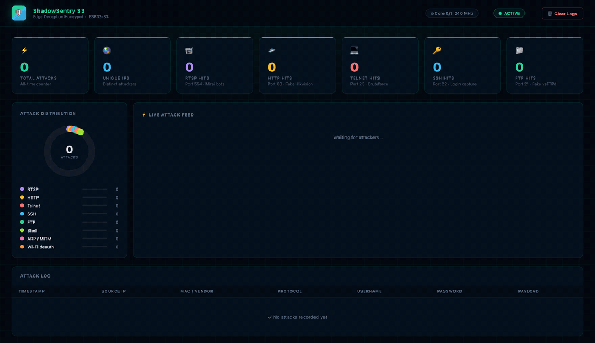

# ShadowSentry S3

> Zero-Configuration, Serverless Hardware Honeypot on a Single ESP32-S3

**🌐 Language:** **English** · [Українська](README.uk.md)




<sub>Live dashboard streaming attacks in real time. Generate this view yourself with the **Demo** button (synthetic attacks, no real data).</sub>

ShadowSentry S3 is a self-contained **Edge Deception** hardware honeypot. It turns a single ESP32-S3 board (~$5) into an invisible trap for botnets, scanners and malware inside your local network. No Raspberry Pi, no cloud servers, no external databases — all processing and logging happen on one chip.

---

## Features

**Honeypot traps (Core 0)**
- **5 protocol traps** — RTSP (554, fake Hikvision camera), HTTP (80, fake NVR login + per-request fingerprinting), Telnet (23), SSH (22), FTP (21). Every credential pair is captured.
- **Real SSH server (wolfSSH)** — genuine SSH-2.0 handshake (curve25519 + ECDSA host key) that decrypts the auth exchange and **captures the plaintext username + password** — not just a banner fingerprint.
- **Interactive fake shell (Cowrie-style)** — Telnet *and* SSH accept the login and drop the attacker into a believable Ubuntu 20.04 shell that answers recon commands while **logging every command**; download/exec commands (`wget`/`curl`/`chmod +x`/`./…`) are flagged as IOCs and escalated.

**Network & radio monitors (Core 1)**
- **ARP-spoof / MITM monitor** — watches the lwIP ARP cache for cache-poisoning signatures (gateway MAC change, one MAC claiming many IPs).
- **Wi-Fi threat monitor** — detects 802.11 deauth/disassoc attacks (incl. the single-frame deauth used for handshake capture) via reason-code-classified forced disconnects + promiscuous broadcast-flood sniffing.
- **MAC + vendor** for every event — resolves the attacker's L2 MAC from the ARP table with a best-effort OUI vendor guess; randomized (private) MACs flagged.
- **Threat-intel / GeoIP enrichment** — resolves each attacker IP to country, ISP/ASN and a reputation tag (`hosting`/`proxy`/`mobile`) via ip-api.com; private IPs labelled `Private LAN` with no external call.

**Platform**
- **Live web dashboard + REST API** on port 9999 (HTTP Basic Auth) — stat cards, attack feed, clickable attack-detail modal. A dedicated **WebSocket push server** (port 9998) streams every new attack to the dashboard in real time, so the feed updates the instant a probe lands instead of waiting for the next poll.
- **Telegram alerts** — async queue with resilient delivery (waits for reconnect + retries, so an alert survives the very deauth that knocks the board offline).
- **SPIFFS persistence** — attack log ring buffer + all-time counter survive reboots.
- **Dual-core design** — honeypot traps on Core 0, admin/alerting/monitors on Core 1.
- **Zero-config & serverless** — flash, set Wi-Fi + Telegram token, done. mDNS `.local` name, no cloud, no database.
- **One-click demo** — a `Demo` button injects synthetic attacks from around the world (fake MACs, real GeoIP flags) so you can showcase the dashboard / record a GIF without exposing real data. Disable with `DEMO_ENDPOINT_ENABLE 0`.

---

## How it works

Thanks to the dual-core Xtensa LX7 processor, the project is split into two isolated worlds:

| Core | Role | Tasks |
|------|------|-------|
| **Core 0** — Hacker World | Receives attacks | RTSP :554 · HTTP :80 · Telnet :23 · SSH :22 · FTP :21 |
| **Core 1** — Admin World  | Management & alerts | Admin Panel :9999 · Telegram · SPIFFS |

```
Attacker / bot
     │
     ├─ Port 554  (RTSP)   → Fake Hikvision DS-2CD camera  ─┐
     ├─ Port  80  (HTTP)   → Fake Hikvision NVR login page  │
     ├─ Port  23  (Telnet) → Fake Ubuntu 20.04 server       ├──► log_store → SPIFFS
     ├─ Port  22  (SSH)    → Fake OpenSSH 8.9p1             │         │
     └─ Port  21  (FTP)    → Fake vsFTPd 3.0.5             ─┘         ▼
                                                                Telegram Alert
                                                                       │
                                                              Admin Panel :9999
                                                             (Dark-mode Dashboard)
```

### What gets captured

| Protocol | Captured | Example |
|----------|----------|---------|
| RTSP | Username + Password | `admin:12345` from the Basic Auth header |
| HTTP | Username + Password + **path + User-Agent** | NVR login POST form; every request (GET/POST/other) is fingerprinted by path and the scanner's User-Agent |
| Telnet | Username + Password **+ post-login commands** | Login prompt, then a fake interactive shell that logs every command |
| SSH | Username + Password **+ post-login commands** | Real SSH-2.0 server (wolfSSH) — `root:hunter2`, then the interactive shell |
| FTP | Username + Password | `USER admin` / `PASS password` (RFC 959) |

> **Real SSH server (wolfSSH).** Port 22 is a genuine SSH-2.0 server, not a banner: wolfSSH performs the full key exchange (curve25519) and presents an ECDSA host key, so the device terminates the crypto and **captures the plaintext username and password** the attacker submits — something a banner-only trap can't do. The login is then accepted (any password; it's a decoy) and the attacker lands in the same interactive fake shell as Telnet, with every command logged. One caveat: wolfSSH advertises its own version string, so a fingerprinting client can tell it isn't OpenSSH — the value here is credential + command capture, not banner mimicry.

> **Interactive fake shell (Cowrie-style).** Instead of endlessly replying "Login incorrect", the Telnet and SSH honeypots *accept* the login and drop the attacker into a believable Ubuntu 20.04 shell that answers common recon commands (`ls`, `cat /etc/passwd`, `uname -a`, `ps`, `ifconfig`, `wget`, …) while **logging every command they type** as a `Shell` event. Capturing the post-login command set reveals attacker TTPs and IOCs — which payloads they fetch, which binaries they try to run — that a credential-only honeypot never sees. Download/exec commands (`wget`/`curl`/`tftp`/`chmod +x`/`./…`) are flagged and escalated to a Telegram alert. Nothing is ever executed: responses are canned, the filesystem is fictional, and downloads are faked. Tunable via `TELNET_SHELL_ENABLE` / `TELNET_LOGIN_GRANT_ATTEMPT` in `config.h`.

> **MAC address for every protocol.** Since the attacker is on the same local network, for each event ShadowSentry resolves their MAC via the lwIP ARP table and shows it together with a best-effort vendor guess (OUI). A randomized MAC (private, typical for smartphones) is flagged separately. The MAC is shown both in the dashboard and in the Telegram alert.

> **Threat-intel enrichment.** A background worker resolves each attacker IP to its country, ISP/ASN and a reputation tag (`hosting` / `proxy` / `mobile`) via [ip-api.com](https://ip-api.com) — free and key-less, so it works the moment you flash it. The result (with a country flag) shows in the dashboard and the Telegram alert; private/LAN source IPs are labelled `Private LAN` without any external call. Lookups run off the hot path and are cached by IP. Tunable via `GEOIP_ENABLE` / `GEOIP_CACHE_SIZE` in `config.h`.

> **Wi-Fi threat monitor (radio layer).** The ESP32 isn't just a TCP stack — it's a Wi-Fi radio, so it can catch **802.11 deauthentication / disassociation attacks** that no software honeypot on a normal network stack can see — including the single-frame deauth used to force a reconnect and capture a WPA2 handshake. Two signals: (1) *forced disconnects* — a deauth knocks the device off-air, so it always observes its own drop, and each drop is classified by its 802.11 reason code (a deauth-induced drop carries a low code 1–9; a benign RF loss reports 200+ and is ignored), so even **one** deauth-attributable disconnect fires an alert with no false positives from a flaky link; (2) *broadcast deauth floods* sniffed in promiscuous mode, carrying the attacker's transmitter MAC and target BSSID. Either raises a `WiFi` event. Runs on the channel the device is associated to — no channel hopping. (Rogue/evil-twin AP detection would need channel hopping and is out of scope for now.) Tunable via `WIFI_MON_ENABLE` / `WIFI_MON_DEAUTH_DISC_THRESHOLD` in `config.h`.

> **ARP-spoof / MITM monitor.** A background task periodically scans the lwIP ARP cache for cache-poisoning signatures — the gateway's MAC changing after a stable baseline is learned, or one MAC claiming several IPs — and raises an `ARP` event (dashboard feed + Telegram) when it sees one. This catches L2 man-in-the-middle attacks that the port honeypots are blind to, since they never complete a TCP handshake. Scope: it detects spoofing that targets this host or is broadcast network-wide (the default for bettercap/ettercap); a strictly point-to-point spoof between two other hosts is out of scope. Tunable via `ARP_MONITOR_ENABLE` / `ARP_SCAN_INTERVAL_S` / `ARP_ALERT_COOLDOWN_S` in `config.h`.

**Detection in action.** Verified on real ESP32-S3 hardware against a live `bettercap` ARP spoof — the instant the attacker poisoned the board's gateway entry, the monitor logged it and pushed a Telegram alert (values below are anonymized):

```
ARP-MON: Gateway 192.168.1.1 MAC changed
         aa:bb:cc:dd:ee:01  ->  de:ad:be:ef:13:37   (MITM redirect)
```

---

## Requirements

### Hardware

- **ESP32-S3** DevKit (any board with ≥ 4 MB Flash)
- USB cable for flashing
- 2.4 GHz Wi-Fi network

### Software

| Component | Version |
|-----------|---------|
| [ESP-IDF](https://docs.espressif.com/projects/esp-idf/en/stable/esp32s3/) | **v5.2+** |
| Python | 3.8+ |
| CMake | 3.16+ |

---

## Installing ESP-IDF

### macOS / Linux

```bash
git clone --recursive https://github.com/espressif/esp-idf.git ~/esp/esp-idf
cd ~/esp/esp-idf
git checkout v5.2.1
./install.sh esp32s3
. ./export.sh
```

### Windows

Download and run the [ESP-IDF Windows Installer](https://dl.espressif.com/dl/esp-idf/).

> After installation, open the **ESP-IDF Command Prompt** for all commands below.

---

## Configuration

```bash
# Copy the configuration template
cp main/config.h.example main/config.h

# Edit it for your setup
nano main/config.h
```

All parameters live in a **single file** — `main/config.h`:

```c
// Network identity (what shows up in the router's device list)
#define DEVICE_HOSTNAME     "Hikvision-NVR"

// Wi-Fi
#define WIFI_SSID           "YourWiFiSSID"
#define WIFI_PASSWORD       "YourWiFiPassword"

// Telegram (get it from @BotFather)
#define TELEGRAM_BOT_TOKEN  "YOUR_BOT_TOKEN"
#define TELEGRAM_CHAT_ID    "YOUR_CHAT_ID"

// Admin panel  →  http://<ip>:9999
#define ADMIN_PASSWORD      "changeme1"
#define ADMIN_PORT          9999

// Honeypot ports
#define RTSP_PORT           554
#define HTTP_PORT           80
#define TELNET_PORT         23
#define SSH_PORT            22
#define FTP_PORT            21
```

> `main/config.h` is added to `.gitignore` — real credentials never reach the repository.

### Getting a Telegram Bot Token

1. Send `/newbot` to [@BotFather](https://t.me/BotFather)
2. Copy the returned token into `TELEGRAM_BOT_TOKEN`
3. Send any message to your bot, then open:
   `https://api.telegram.org/bot<TOKEN>/getUpdates`
4. Find `"chat":{"id":...}` — that is your `TELEGRAM_CHAT_ID`

---

## Build & flash

```bash
# 1. Clone the repository
git clone https://github.com/Rdx1S/ShadowSentryS3.git
cd ShadowSentryS3

# 2. Activate ESP-IDF
. ~/esp/esp-idf/export.sh

# 3. Copy and fill in the config
cp main/config.h.example main/config.h
nano main/config.h

# 4. Build and flash (replace /dev/ttyUSB0 with your port)
idf.py -p /dev/ttyUSB0 flash monitor
```

### Finding the port

| OS | Command |
|----|---------|
| Linux | `ls /dev/ttyUSB*` or `ls /dev/ttyACM*` |
| macOS | `ls /dev/cu.usb*` |
| Windows | Device Manager → Ports (COM & LPT) |

---

## First boot

After flashing, the monitor shows:

```
I (426) MAIN: ╔══════════════════════════════════════╗
I (428) MAIN: ║    ShadowSentry S3  v1.0             ║
I (434) MAIN: ║    Edge Deception HoneyPot           ║
I (439) MAIN: ║    ESP32-S3  |  ESP-IDF v5.x         ║
I (444) MAIN: ╚══════════════════════════════════════╝
I (1827) WIFI: IP acquired: 192.168.1.105
I (1830) WIFI: Admin panel → http://192.168.1.105:9999
I (1842) WIFI: mDNS started → http://hikvision-nvr.local:9999
I (1904) RTSP: Honeypot listening on port 554
I (1910) HTTP: Honeypot listening on port 80
I (1916) TELNET: Honeypot listening on port 23
I (1924) SSH: Honeypot listening on port 22
I (1930) FTP: Honeypot listening on port 21
I (1938) ADMIN: Admin panel on port 9999
```

Open a browser → `http://192.168.1.105:9999`  
Login: `admin` / the password from `ADMIN_PASSWORD`.

> **No need to memorize the IP.** Thanks to mDNS the device is always reachable at a stable name — `http://hikvision-nvr.local:9999` — regardless of the address DHCP assigns. Works out of the box on macOS, Linux (avahi), Windows 10+, iOS and Android. The name is configurable via `MDNS_HOSTNAME` in `config.h`.

---

## Admin Dashboard

A dark-mode web interface with a real-time WebSocket feed (new attacks appear instantly), backed by a 10-second poll for reconciliation and threat-intel updates. Every stat card and distribution row is **clickable to filter** the feed/table by attack type, and the **Demo** button seeds a sample of global attacks for screenshots:

- **6 stat cards** — Total, Unique IPs, RTSP, HTTP, Telnet, SSH, FTP
- **Donut chart** — real-time breakdown of attacks per protocol
- **Attack table** — timestamp, IP, **MAC + vendor**, protocol, captured credentials, payload
- **Footer** — device uptime, free heap, Wi-Fi signal strength (RSSI)
- **Clear button** — wipes the logs from flash

### REST API

| Method | Endpoint | Description |
|--------|----------|-------------|
| `GET` | `/api/attacks` | Attack log + statistics (JSON) |
| `GET` | `/api/status` | Uptime / heap / RSSI (JSON) |
| `POST` | `/api/clear` | Clear the log |

All endpoints are protected with HTTP Basic Auth (`admin` / `ADMIN_PASSWORD`).

---

## Project structure

```
ShadowSentryS3/
├── CMakeLists.txt              ESP-IDF root build file
├── sdkconfig.defaults          ESP32-S3 defaults (240 MHz, dual-core)
├── partitions.csv              NVS(24KB) + App(3MB) + SPIFFS(1MB)
└── main/
    ├── config.h.example        ← Configuration template (copy to config.h)
    ├── config.h                ← Real settings (in .gitignore)
    ├── idf_component.yml        Managed dependencies (espressif/mdns)
    ├── main.c                  Entry point, task distribution across cores
    ├── wifi_manager.c/h        Wi-Fi STA, DHCP hostname, SNTP, mDNS, ARP helpers
    ├── arp_monitor.c/h         ARP-spoof / MITM detector              (Core 1)
    ├── wifi_monitor.c/h        Wi-Fi deauth-flood detector (promisc)  (Core 1)
    ├── geoip.c/h               Threat-intel enrichment (ip-api.com)   (Core 1)
    ├── index.html              Dashboard HTML (embedded into the firmware)
    ├── CMakeLists.txt
    ├── honeypot/               ── Core 0 — Hacker World ──────────────
    │   ├── rtsp_trap.c/h       Port 554, Fake Hikvision, Base64 creds
    │   ├── http_trap.c/h       Port 80, Fake NVR login page
    │   ├── telnet_trap.c/h     Port 23, Fake Ubuntu 20.04 login
    │   ├── fake_shell.c/h      Interactive post-login shell (command capture)
    │   ├── ssh_trap.c/h        Port 22, Real SSH server (wolfSSH) — captures creds
    │   ├── ssh_hostkey.h       Embedded ECDSA host key (decoy)
    │   └── ftp_trap.c/h        Port 21, Fake vsFTPd 3.0.5, full creds
    ├── admin/                  ── Core 1 — Admin World ───────────────
    │   ├── admin_panel.c/h     Port 9999, HTTP Basic Auth, REST API
    │   ├── ws_server.c/h       Port 9998, live WebSocket event push
    │   └── telegram.c/h        Async FreeRTOS queue → Telegram Bot API
    └── storage/
        └── log_store.c/h       RAM ring buffer (200 entries) + SPIFFS
```

---

## How an attack is detected

No legitimate home-network device (laptop, phone, Smart TV) **ever** connects to ports 554, 80, 23, 22 or 21 on the ESP32 board.

> **Any connection to ShadowSentry S3 = a 100% anomaly.**

Typical detection scenarios:

| Threat | Behaviour | Detection time |
|--------|-----------|----------------|
| Mirai / Mozi botnet | Brute-force RTSP/Telnet/FTP | < 5 s |
| Post-login intrusion | Commands run in the fake Telnet shell (recon, payload fetch) | per command |
| Ransomware lateral movement | Subnet scanning | < 5 s |
| SSH scanner | Version fingerprint on port 22 | < 1 s |
| Web scanner | GET / on port 80 | < 1 s |
| Manual scan (nmap) | SYN on any port | < 1 s |
| ARP spoofing / MITM | Gateway MAC change or one MAC claiming many IPs | ≤ scan interval (8 s) |
| Wi-Fi deauth / disassoc attack | Reason-code-classified forced disconnect (≥1) or broadcast flood (promiscuous) | ≤ window (2 s) |

---

## ESP-IDF dependencies

All components ship with ESP-IDF — nothing to install separately:

- `lwIP` — TCP/IP stack, raw sockets
- `FreeRTOS` — multitasking, queues
- `esp_http_client` — Telegram Bot API
- `mbedTLS` — Base64 decode for Basic Auth
- `SPIFFS` — flash file system
- `esp_netif_sntp` — time synchronization

One component is fetched automatically by the component manager (declared in `main/idf_component.yml`, downloaded on the first build):

- `espressif/mdns` — `.local` name resolution (reach the admin panel by name)

---

## Troubleshooting

**Won't connect to Wi-Fi**
```
ESP32-S3 supports 2.4 GHz only. Check the SSID/password in config.h.
```

**`idf.py: command not found`**
```bash
. ~/esp/esp-idf/export.sh
```

**Permission denied on /dev/ttyUSB0 (Linux)**
```bash
sudo usermod -a -G dialout $USER
# Log out and back in
```

**`SPIFFS: mount failed` error**
```bash
idf.py -p /dev/ttyUSB0 erase-flash
idf.py -p /dev/ttyUSB0 flash
```

**Telegram doesn't send alerts**
```
Make sure the bot isn't blocked and you sent it /start.
TELEGRAM_CHAT_ID is a number (can be negative for groups).
```

---

## Roadmap

**Shipped**
- [x] 5 protocol honeypot traps (RTSP / HTTP / Telnet / SSH / FTP)
- [x] Per-attack MAC + vendor (OUI) resolution
- [x] HTTP request fingerprinting (method / path / User-Agent)
- [x] Telegram alerts with resilient delivery + retry
- [x] Live web dashboard + REST API, clickable attack-detail modal
- [x] mDNS `.local` resolution
- [x] ARP-spoof / MITM monitor
- [x] Threat-intel / GeoIP enrichment (country · ASN · reputation)
- [x] Wi-Fi deauth/disassoc threat monitor (reason-code classified)
- [x] Interactive fake shell with per-command logging + IOC escalation (Telnet)
- [x] Real SSH server via wolfSSH — credential capture + fake shell
- [x] Live WebSocket dashboard — real-time event push (polling fallback)

**Planned**
- [ ] SSH version-banner spoofing (present as OpenSSH, not wolfSSH)
- [ ] Per-device SSH host-key generation at first boot (NVS-cached)
- [ ] Rogue / evil-twin AP detection (requires channel hopping)
- [ ] Additional protocol traps (SMB, MQTT, UPnP)

---

## License

MIT — use, modify and distribute freely.
